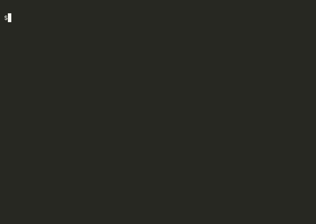

# Canvas




> Touch-driven drawing canvas built with CoreGraphics and UIBezierPath, where each finger movement appends a line segment to the active path and calls `setNeedsDisplay` to trigger an immediate Core Graphics redraw cycle.

## Features

- **Freehand drawing:** `touchesMoved(_:with:)` translates each `UITouch` location into a `UIBezierPath` `addLine(to:)` call, accumulating all strokes in a persistent path array rendered on every draw pass.
- **Immediate redraw:** `setNeedsDisplay()` is called on every touch event, causing the view's `draw(_:)` to execute synchronously on the main run loop at display refresh rate.
- **Emoji face drag-and-drop:** A tray of `UIImageView` face assets is dragged onto the canvas via `UIPanGestureRecognizer`; on `.began`, a new `UIImageView` is cloned from the source and inserted into the view hierarchy at the adjusted coordinate (`trayView.frame.origin.y` offset applied).
- **Spring-animated tray:** The sticker tray slides up/down with `UIView.animate(withDuration:delay:usingSpringWithDamping:initialSpringVelocity:)` — damping 0.5 for the upward snap (bouncy) and 0.8 for the downward dismiss (tight).
- **Velocity-aware gesture dismissal:** On pan `.ended`, `sender.velocity(in:)` determines swipe direction; positive Y dismisses the tray, negative Y snaps it open.
- **Independent coordinate spaces:** Face images dragged from the tray are repositioned from tray-local to canvas-global coordinates before being added to the superview, avoiding misaligned drop positions.

## Tech Stack

| Layer | Technology |
|---|---|
| Language | Swift 3.0 |
| Drawing | CoreGraphics, UIBezierPath |
| Input | UITouch event handling, UIPanGestureRecognizer |
| Animation | UIView spring animations |
| Layout | UIKit, Interface Builder |

## Architecture

`CanvasViewController` inherits from a thin `ViewController` base and owns both the drawing canvas and the slide-up tray. The tray pan gesture and the face drag gesture are separate `@IBAction` handlers, each tracking their own `originalCenter` to compute translation deltas correctly. Sticker `UIImageView` instances are created dynamically at runtime and added directly to the root view — no collection model needed since the canvas treats dropped faces as persistent subviews.

## Key Implementation

**Path accumulation:** Each `draw(_:)` call iterates the full path array and strokes every segment into the current `CGContext`. Paths are never cleared between frames, so prior strokes persist without needing a backing bitmap or offscreen render target.

**Tray offset correction:** When a face is dragged from the tray onto the canvas, its center is computed as `imageView.center` (tray-local) plus `trayView.frame.origin.y`, translating from the tray's coordinate system into the root view before the new `UIImageView` is inserted as a subview.

**Spring parameter tuning:** The upward snap uses `usingSpringWithDamping: 0.5` to produce a visible overshoot, while the downward dismiss uses `0.8` to land without bouncing — giving distinct physical feel to each direction.

## Setup

```bash
git clone https://github.com/gerardrecinto/canvas-ios.git
open canvas-ios/canvasLab.xcodeproj
```

Build and run on the iOS Simulator (Xcode 8+). No dependencies or API keys required.
